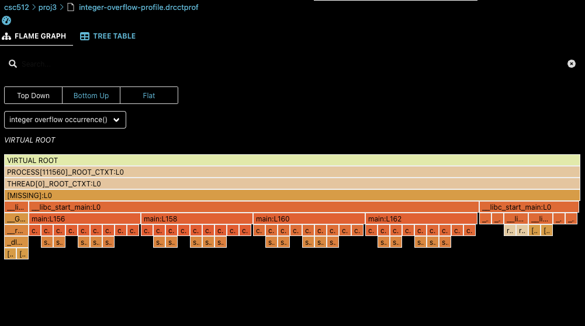

# CSC 512 Project 3 Extra Credit
Brian Park

1. Here is the visualization 



2. I used the overflow bit solution with the help from DynamoRIO flag (`EFLAGS_READ_OF`) listed [here](https://dynamorio.org/globals_e.html). That was the easiest solution, and it can detect nearly the same outputs, with just fewer lines of code! I prefer this solution better as it is neater and abstracts all teh details away.

```cpp
static inline bool
IntegerOverflow(Instruction *instr, uint64_t flagsValue)
{
    Operand srcOpnd0 = instr->getSrcOperand(0);
    Operand srcOpnd1 = instr->getSrcOperand(1);
    Operand dstOpnd = instr->getDstOperand(0);
    std::bitset<64> bitFlagsValue(flagsValue);
    OperatorType optype = instr->getOperatorType();

    if (optype == OperatorType::kOPadd || 
        optype == OperatorType::kOPsub || 
        optype == OperatorType::kOPshl) {
        return (flagsValue & EFLAGS_READ_OF) == 0;
    } else {
        return false;
    }
}
```


3. I think using flag bits is more efficient. We can utilize hardware bits to do simple detection using bitwise operators. Doing the algorithm from slide 12 incurs too much overhead, especially if you're trying to detect overflow for a very large program. How much is that overhead? I quickly measured it, but it's 3.131s for the flag implementation and 3.719s for my hand made implementation from lecture. It's not much of a difference, but it indicates that my code is inefficienct for detecting integer overflow manually.
